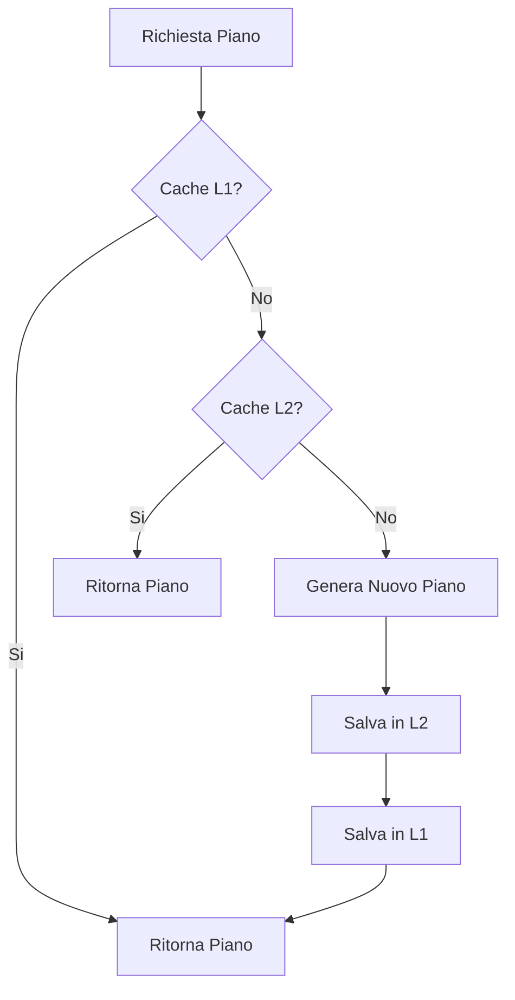
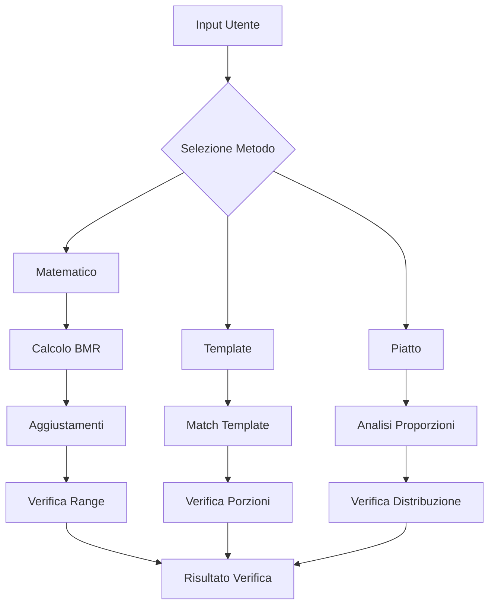

# MediterranIA: Logica Implementativa e Guide di Integrazione

## 1. Logica Implementativa Dettagliata

### 1.1 Sistema di Cache Multi-livello
Il sistema implementa una strategia di caching a più livelli:

1. **Cache in Memoria (L1)**
   - Utilizza `lru_cache` per memorizzare le ricette più frequentemente accedute
   - Mantiene un limite massimo di 128 ricette in cache
   - Implementa statistiche di hit/miss per monitorare l'efficacia

2. **Cache Distribuita (L2)**
   - Utilizza Redis per la persistenza dei piani alimentari completi
   - Chiave di cache basata su hash dei parametri utente rilevanti
   - TTL di 1 ora per assicurare la freschezza dei dati



### 1.2 Logica di Verifica Nutrizionale
Il sistema utilizza tre approcci di verifica:

1. **Approccio Matematico**
   - Calcolo BMR usando formula Harris-Benedict
   - Aggiustamenti basati su obiettivo (-15% per perdita peso, +15% per massa)
   - Range flessibili per macronutrienti

2. **Approccio Template**
   - Template predefiniti per tipo pasto
   - Basato su porzioni standard
   - Più intuitivo per utenti finali

3. **Approccio Piatto**
   - Divisione visuale del piatto
   - Proporzioni basate su Harvard Plate Method
   - Facile da seguire senza pesare alimenti



### 1.3 Sistema di Sostituzione Intelligente
Implementa una logica di sostituzione per gestire:
- Allergie alimentari
- Preferenze verdure
- Alternative al latte
- Restrizioni dietetiche

Il sistema utilizza un grafo di sostituzione dove:
- Nodi = ingredienti
- Archi = possibili sostituzioni
- Pesi = similarità nutrizionale

### 1.4 Performance Monitoring
Sistema di monitoraggio integrato che traccia:
- Tempo di generazione piani
- Hit rate cache
- Utilizzo memoria
- Latenza operazioni database

## 2. Vtiger CRM Integration Guide

### 2.1 Setup Iniziale
```python
from vtigerapi import VTigerAPI

class VTigerIntegrator:
    def __init__(self, url: str, username: str, access_key: str):
        self.api = VTigerAPI(url, username, access_key)
        
    def create_meal_plan_record(self, user_id: str, piano: Dict):
        """Create meal plan record in Vtiger"""
        record_data = {
            'assigned_user_id': user_id,
            'meal_plan_data': json.dumps(piano),
            'status': 'Active',
            'creation_date': datetime.now().isoformat()
        }
        return self.api.create_record('MealPlans', record_data)
```

### 2.2 Custom Module Definition
```xml
<?xml version='1.0'?>
<module>
    <name>MealPlans</name>
    <label>Meal Plans</label>
    <parent>Tools</parent>
    <fields>
        <field>
            <fieldname>meal_plan_data</fieldname>
            <fieldlabel>Piano Alimentare</fieldlabel>
            <fieldtype>text</fieldtype>
        </field>
        <field>
            <fieldname>status</fieldname>
            <fieldlabel>Status</fieldlabel>
            <fieldtype>picklist</fieldtype>
            <values>Active,Inactive,Completed</values>
        </field>
    </fields>
</module>
```

### 2.3 Workflow Integration
1. Creare workflow trigger su nuovo contatto
2. Configurare azione automatica per generazione piano
3. Collegare piano al record contatto
4. Impostare notifiche per aggiornamenti piano

## 3. PDF Generator Module

### 3.1 Setup Base
```python
from fpdf import FPDF
import qrcode
from datetime import datetime

class PianoPDF(FPDF):
    def __init__(self):
        super().__init__()
        self.set_auto_page_break(auto=True, margin=15)
        self._set_styles()
        
    def _set_styles(self):
        self.add_font('Helvetica', '', 'helvetica.ttf')
        self.set_font('Helvetica', '', 12)
```

### 3.2 Generazione Contenuti
```python
class GeneratorePDF:
    def __init__(self, piano: Dict, dati_utente: Dict):
        self.piano = piano
        self.utente = dati_utente
        self.pdf = PianoPDF()
        
    def genera_pdf(self) -> bytes:
        self.pdf.add_page()
        self._genera_intestazione()
        self._genera_dati_utente()
        self._genera_piano_settimanale()
        self._genera_analisi_nutrizionale()
        self._genera_suggerimenti()
        self._genera_qr_code()
        return self.pdf.output(dest='S')
        
    def _genera_piano_settimanale(self):
        """Genera tabella piano settimanale"""
        giorni = ['Lunedì', 'Martedì', 'Mercoledì', 'Giovedì', 
                 'Venerdì', 'Sabato', 'Domenica']
        pasti = ['Colazione', 'Spuntino', 'Pranzo', 
                'Spuntino', 'Cena']
                
        # Implementazione tabella...
```

### 3.3 Layout Template
```python
def _genera_intestazione(self):
    self.pdf.set_font('Helvetica', 'B', 24)
    self.pdf.cell(0, 20, 'Piano Alimentare Personalizzato', 0, 1, 'C')
    self.pdf.ln(10)
    
def _genera_dati_utente(self):
    """Genera sezione dati utente"""
    self.pdf.set_font('Helvetica', 'B', 14)
    self.pdf.cell(0, 10, 'Dati Personali', 0, 1)
    self.pdf.set_font('Helvetica', '', 12)
    
    dati = [
        f"Nome: {self.utente['nome']}",
        f"Età: {self.utente['età']} anni",
        f"Obiettivo: {self.utente['obiettivo']}",
        f"Tipo Dieta: {self.utente['tipo_dieta']}"
    ]
    
    for dato in dati:
        self.pdf.cell(0, 8, dato, 0, 1)
```

### 3.4 Analisi Nutrizionale
```python
def _genera_analisi_nutrizionale(self):
    """Genera grafici e analisi nutrizionale"""
    self.pdf.add_page()
    self.pdf.set_font('Helvetica', 'B', 16)
    self.pdf.cell(0, 10, 'Analisi Nutrizionale', 0, 1)
    
    # Implementa grafici macronutrienti
    self._genera_grafico_macro()
    
    # Implementa tabella valori nutrizionali
    self._genera_tabella_nutrienti()
```

## Appendice A: Best Practices Vtiger Integration

1. **Autenticazione**
   - Utilizzare access token invece di username/password
   - Implementare refresh token automatico
   - Gestire errori di autenticazione

2. **Gestione Dati**
   - Cache locale per dati frequenti
   - Batch update per operazioni multiple
   - Logging operazioni critiche

3. **Workflow**
   - Trigger automatici per eventi chiave
   - Notifiche per stakeholders
   - Gestione errori e retry

## Appendice B: PDF Generation Guidelines

1. **Layout Standards**
   - Margini: 2.5cm tutti i lati
   - Font: Helvetica per leggibilità
   - Dimensioni testo: 12pt corpo, 14pt sottotitoli, 24pt titoli

2. **Contenuti**
   - Dati personali
   - Piano settimanale
   - Analisi nutrizionale
   - Lista spesa
   - QR code per versione digitale

3. **Branding**
   - Logo in intestazione
   - Colori corporate
   - Footer con contatti

4. **Accessibilità**
   - Contrasto adeguato
   - Gerarchia visiva chiara
   - Font leggibili

